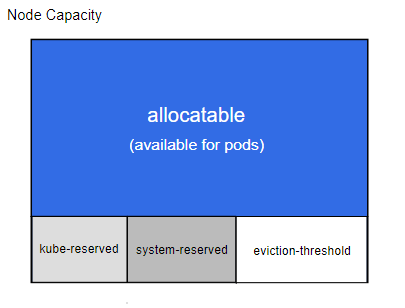
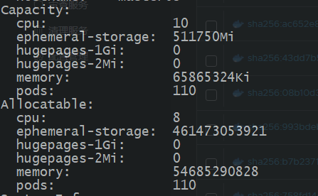

# 1  前言

最近k8s在使用过程中遇到这样一个问题

**由于Pod没有对内存及CPU进行限制，导致Pod在运行过程中所需的内存超过了节点本身的内存（OOM），从而导致节点崩溃，使得运行在该节点上的所有Pod都失败了**

为了解决这个问题以及提高节点的稳定性，综合k8s的一些特性，方案如下

* 每个节点为系统守护进程预留计算资源(CPU、内存、磁盘空间)
* Pod驱逐：节点资源到达一定使用量，开始驱逐 pod
* 每个Pod需指定所需资源

# 2 预留资源

Kubernetes 的节点可以按照 `Capacity` 调度。默认情况下 pod 能够使用节点全部可用容量。 这是个问题，因为节点自己通常运行了不少驱动 OS 和 Kubernetes 的系统守护进程。 除非为这些系统守护进程留出资源，否则它们将与 Pod 争夺资源并导致节点资源短缺问题。

`kubelet` 公开了一个名为 'Node Allocatable' 的特性，有助于为系统守护进程预留计算资源。 Kubernetes 推荐集群管理员按照每个节点上的工作负载密度配置 'Node Allocatable'。



Kubernetes 节点上的 'Allocatable' 被定义为 Pod 可用计算资源量。 调度器不会超额申请 'Allocatable'。 目前支持 'CPU'、'memory' 和 'ephemeral-storage' 这几个参数。

可分配的节点暴露为 API 中 `v1.Node` 对象的一部分，也是 CLI 中 `kubectl describe node` 的一部分。

在 `kubelet` 中，可以为两类系统守护进程预留资源。

**Node Capacity：Node的所有硬件资源**

| Node Capacity                   | 说明                                                                                                                                                                                     |
| ------------------------------- | ---------------------------------------------------------------------------------------------------------------------------------------------------------------------------------------- |
| kube-reserved                   | 给kube组件预留的资源：kubelet,kube-proxy以及docker等                                                                                                                                     |
| system-reserved                 | 给system进程预留的资源                                                                                                                                                                   |
| eviction-threshold              | kubelet eviction的阈值设定                                                                                                                                                               |
| allocatable(available for pods) | Allocatable 被定义为 pod 可用计算资源量。调度器不会超额申请 Allocatable。<br />目前支持 CPU, memory 和 storage 这几个参数<br />（保证Node上所有Pods的request resource不超过Allocatable） |

allocatable的值即对应 describe node 时看到的allocatable容量，pod 调度的上限

计算公式：节点上可配置值 = 总量 - 预留值 - 驱逐阈值

```bash
Allocatable = Capacity - Reserved(kube+system) - Eviction Threshold
```

## Kube-reserved

* **Kubelet 标志** ：`--kube-reserved=[cpu=100m][,][memory=100Mi][,][ephemeral-storage=1Gi][,][pid=1000]`
* **Kubelet 标志** ：`--kube-reserved-cgroup=`

`kube-reserved` 用来给诸如 `kubelet`、容器运行时、节点问题监测器等 Kubernetes 系统守护进程记述其资源预留值。 该配置并非用来给以 Pod 形式运行的系统守护进程预留资源。`kube-reserved` 通常是节点上 `Pod 密度` 的函数。

除了 `cpu`、`内存` 和 `ephemeral-storage` 之外，`pid` 可用来指定为 Kubernetes 系统守护进程预留指定数量的进程 ID。

**设置方式**

1. systemctl status kubelet 查看 kubelet启动的配置文件路径：--kubeconfig=/etc/kubernetes/kubelet.conf --config=/var/lib/kubelet/config.yaml
2. 编辑/var/lib/kubelet/config.yaml，添加如下内容

   ```yaml
   apiVersion: kubelet.config.k8s.io/v1beta1
   ...
   kubeReserved:  # 配置 kube 资源预留, 根据实际情况进行设置
     cpu: 1000m
     memory: 5Gi
     ephemeral-storage: 5Gi
   ```


## System-reserved

* **Kubelet 标志** ：`--system-reserved=[cpu=100m][,][memory=100Mi][,][ephemeral-storage=1Gi][,][pid=1000]`
* **Kubelet 标志** ：`--system-reserved-cgroup=`

`system-reserved` 用于为诸如 `sshd`、`udev` 等系统守护进程记述其资源预留值。 `system-reserved` 也应该为 `kernel` 预留 `内存`，因为目前 `kernel` 使用的内存并不记在 Kubernetes 的 Pod 上。 同时还推荐为用户登录会话预留资源（systemd 体系中的 `user.slice`）。

除了 `cpu`、`内存` 和 `ephemeral-storage` 之外，`pid` 可用来指定为 Kubernetes 系统守护进程预留指定数量的进程 ID。

**设置方式**

编辑/var/lib/kubelet/config.yaml，添加如下内容

```bash
apiVersion: kubelet.config.k8s.io/v1beta1
...
systemReserved:  # 配置系统资源预留
  cpu: 1000m
  memory: 10Gi
  ephemeral-storage: 10Gi

```

## Eviction Thresholds

**Kubelet 标志** ：`--eviction-hard=[memory.available<500Mi]`

节点级别的内存压力将导致系统内存不足，这将影响到整个节点及其上运行的所有 Pod。 节点可以暂时离线直到内存已经回收为止。为了防止系统内存不足（或减少系统内存不足的可能性）， kubelet 提供了资源不足管理。 驱逐操作只支持 `memory` 和 `ephemeral-storage`。 通过 `--eviction-hard` 标志预留一些内存后，当节点上的可用内存降至预留值以下时， `kubelet` 将尝试驱逐 Pod。 如果节点上不存在系统守护进程，Pod 将不能使用超过 `capacity-eviction-hard` 所指定的资源量。 因此，为驱逐而预留的资源对 Pod 是不可用的。

**设置方式**

```yaml
apiVersion: kubelet.config.k8s.io/v1beta1
...
evictionHard:
  memory.available: 1Gi
  nodefs.available: "10%""

```


## 实施节点可分配约束

 **Kubelet 标志** ：`--enforce-node-allocatable=pods[,][system-reserved][,][kube-reserved]`

调度器将 'Allocatable' 视为 Pod 可用的 `capacity`（资源容量）。

`kubelet` 默认对 Pod 执行 'Allocatable' 约束。 无论何时，如果所有 Pod 的总用量超过了 'Allocatable'，驱逐 Pod 的措施将被执行。 可通过设置 kubelet `--enforce-node-allocatable` 标志值为 `pods` 控制这个措施。

可选地，通过在同一标志中同时指定 `kube-reserved` 和 `system-reserved` 值， 可以使 `kubelet` 强制实施 `kube-reserved` 和 `system-reserved` 约束。 请注意，要想执行 `kube-reserved` 或者 `system-reserved` 约束， 需要对应设置 `--kube-reserved-cgroup` 或者 `--system-reserved-cgroup`

默认情况下只对Pod进行约束，在对系统进程约束时需要注意一些系统核心进程被杀掉导致节点失效的问题。

**设置方式**

```yaml
apiVersion: kubelet.config.k8s.io/v1beta1
...
systemReservedCgroup: /system.slice
enforceNodeAllocatable:
  - pods
  - system-reserved
```

# 3 Pod优先级

系统守护进程一般会被按照类似 Guaranteed 的 Pod 一样对待。 系统守护进程可以在与其对应的控制组中出现突发资源用量，这一行为要作为 Kubernetes 部署的一部分进行管理。 例如，`kubelet` 应该有它自己的控制组并和容器运行时共享 `kube-reserved` 资源。 不过，如果执行了 `kube-reserved` 约束，则 kubelet 不可出现突发负载并用光节点的所有可用资源。

在执行 `system-reserved` 预留策略时请加倍小心，因为它可能导致节点上的关键系统服务出现 CPU 资源短缺、 因为内存不足而被终止或者无法在节点上创建进程。 建议只有当用户详尽地描述了他们的节点以得出精确的估计值， 并且对该组中进程因内存不足而被杀死时，有足够的信心将其恢复时， 才可以强制执行 `system-reserved` 策略。

* 作为起步，可以先针对 `pods` 上执行 'Allocatable' 约束。
* 一旦用于追踪系统守护进程的监控和告警的机制到位，可尝试基于用量估计的方式执行 `kube-reserved` 策略。
* 随着时间推进，在绝对必要的时候可以执行 `system-reserved` 策略。

当资源不足时，配置了如上驱逐参数，pod之间的驱逐顺序是怎样的呢？以下描述设置不同优先级来确保集群中核心的组件不被驱逐还正常运行，OOM 的优先级如下,pod oom 值越低，也就越不容易被系统杀死。

*BestEffort Pod > Burstable Pod > 其它进程（内核init进程等） > Guaranteed Pod > kubelet/docker 等 > sshd 等进程*

kubernetes 把 pod 分成了三个 QoS 等级，而其中和limits和requests参数有关：

* Guaranteed：oom优先级最低，可以考虑数据库应用或者一些重要的业务应用。除非 pods 使用超过了它们的 limits，或者节点的内存压力很大而且没有 QoS 更低的 pod，否则不会被杀死。
* Burstable：这种类型的 pod 可以多于自己请求的资源（上限有 limit 指定，如果 limit 没有配置，则可以使用主机的任意可用资源），但是重要性认为比较低，可以是一般性的应用或者批处理任务。
* Best Effort：oom优先级最高，集群不知道 pod 的资源请求情况，调度不考虑资源，可以运行到任意节点上（从资源角度来说），可以是一些临时性的不重要应用。pod 可以使用节点上任何可用资源，但在资源不足时也会被优先杀死。

Pod 的 requests 和 limits 是如何对应到这三个 QoS 等级上的，可以用下面一张表格概括：

| request是否配置 | limits是否配置 | 两者的关系      | Qos                        | 说明                                                                                                                                                                   |
| --------------- | -------------- | --------------- | -------------------------- | ---------------------------------------------------------------------------------------------------------------------------------------------------------------------- |
| 是              | 是             | requests=limits | Guaranteed                 | 所有容器的cpu和memory都必须配置相同的requests和limits                                                                                                                  |
| 是              | 是             | request<limit   | Burstable                  | 只要有容器配置了cpu或者memory的request和limits就行                                                                                                                     |
| 是              | 否             |                 | Burstable                  | 只要有容器配置了cpu或者memory的request就行                                                                                                                             |
| 否              | 是             |                 | Guaranteed/<br />Burstable | 如果配置了limits，k8s会自动把对应资源的request设置和limits一样。<br />如果所有容器所有资源都配置limits，那就是Guaranteed;如果只有部分配置了limits，<br />就是Burstable |
| 否              | 否             |                 | Best Effort                | 所有的容器都没有配置资源requests或limits                                                                                                                               |

说明：

* request和limits相同，可以参考资源动态调整中的VPA设置合理值。
* 如果只配置了limits，没有配置request，k8s会把request值和limits值一样。
* 如果只配置了request，没有配置limits，该pod共享node上可用的资源，实际上很反对这样设置。


# 4 生产应用

## 配置文件

编辑/var/lib/kubelet/config.yaml

```yaml
apiVersion: kubelet.config.k8s.io/v1beta1
...
# 添加如下内容
systemReserved:
  memory: 5Gi
  cpu: 1000m
  ephemeral-storage: 10Gi
kubeReserved:
  memory: 5Gi
  cpu: 1000m
  ephemeral-storage: 10Gi
evictionHard:
  memory.available: "3%"
  nodefs.available: "10%"
# systemReservedCgroup: /system.slice
enforceNodeAllocatable:
  - pods
  # - system-reserved
```

## 重启kubelet服务

```yaml
systemctl restart kubelet
```

## 查看节点资源



| 资源类型          | SystemReserved | KubeReserved | EvictionHard  | Allocatable | All     |
| ----------------- | -------------- | ------------ | ------------- | ----------- | ------- |
| CPU               | 1000m          | 1000m        | 0             | 8000m       | 1000m   |
| Memory            | 5Gi            | 5Gi          | 1.88Gi （3%） | 50.93Gi     | 62.81Gi |
| Ephemeral-storage | 10Gi           | 10Gi         | 50Gi          | 429.7Gi     | 499.7Gi |

Allocatable = All - SystemReserved - KubeReserved - EvictionHard

说明配置成功。
