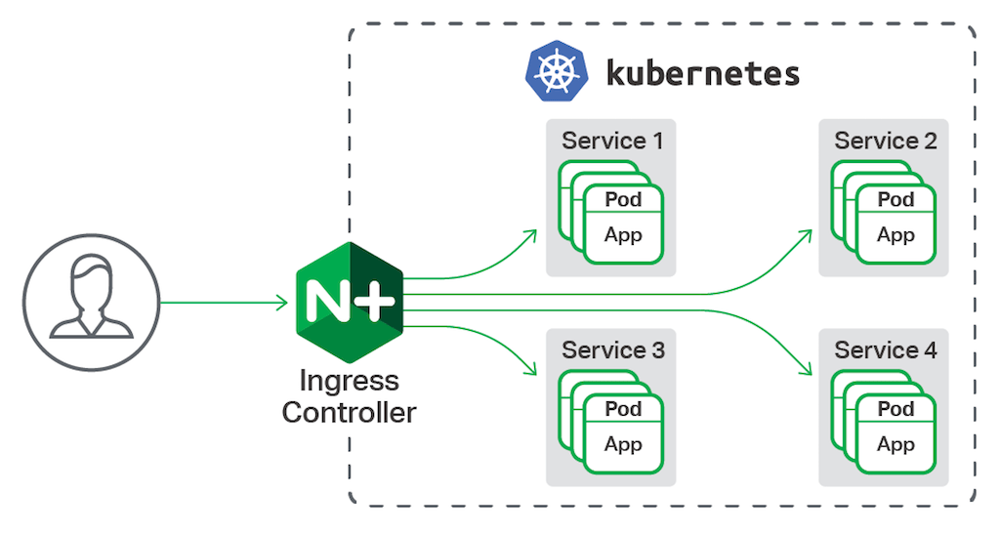
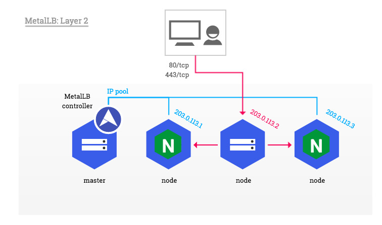

在Kubernetes中，服务和Pod的IP地址仅可以在集群网络内部使用，对于集群外的应用是不可见的。为了使外部的应用能够访问集群内的服务，Kubernetes 目前提供了以下几种方案：

* NodePort
* LoadBalancer
* Ingress

为了解决外部访问k8s内服务及负载均衡问题，这里介绍如何安装ingress-nginx-controller与metallb两个应用。

ingress-nginx-controller：解决服务暴露与负载均衡问题

metallb：为k8s集群的service提供LoadBalancer类型的支持

# 安装ingress-nginx-controller

## 简介

[官方介绍](https://kubernetes.github.io/ingress-nginx/)

**Nginx** ：反向代理负载均衡器

**Ingress Controller**：Ingress Controller 可以理解为控制器，它通过不断的跟 Kubernetes API 交互，实时获取后端 Service、Pod 等的变化，比如新增、删除等，然后结合 Ingress 定义的规则生成配置，然后动态更新上边的 Nginx 负载均衡器，并刷新使配置生效，来达到服务自动发现的作用。

 **Ingress** ：Ingress 则是定义规则，通过它定义某个域名的请求过来之后转发到集群中指定的 Service。它可以通过 Yaml 文件定义，可以给一个或多个 Service 定义一个或多个 Ingress 规则。

ingress-nginx-controller工作原理如下图



### Ingress 组成

* 将Nginx的配置抽象成一个Ingress对象，每添加一个新的服务只需写一个新的Ingress的yaml文件即可
* 将新加入的Ingress转化成Nginx的配置文件并使之生效
* ingress controller
* ingress服务

### Ingress 工作原理

* ingress controller通过和kubernetes api交互，动态的去感知集群中ingress规则变化，
* 然后读取它，按照自定义的规则，规则就是写明了哪个域名对应哪个service，生成一段nginx配置，
* 再写到nginx-ingress-controller的pod里，这个Ingress
  controller的pod里运行着一个Nginx服务，控制器会把生成的nginx配置写入/etc/nginx.conf文件中，
* 然后reload一下使配置生效。以此达到域名分配置和动态更新的问题。

### Ingress 可以解决

**动态配置服务**

如果按照传统方式, 当新增加一个服务时, 我们可能需要在流量入口加一个反向代理指向我们新的服务. 而如果用了Ingress, 只需要配置好这个服务, 当服务启动时, 会自动注册到Ingress的中, 不需要额外的操作.

**减少不必要的端口暴露**

配置过k8s的都清楚, 第一步是要关闭防火墙的, 主要原因是k8s的很多服务会以NodePort方式映射出去, 这样就相当于给宿主机打了很多孔, 既不安全也不优雅. 而Ingress可以避免这个问题, 除了Ingress自身服务可能需要映射出去, 其他服务都不要用NodePort方式

## 安装

我们使用helm3进行安装，所以请先安装好[helm3](https://helm.sh/docs/intro/install/)

```bash
helm repo add ingress-nginx https://kubernetes.github.io/ingress-nginx
helm repo update
# 查询所有版本信息
master01 ➜  ~ helm search repo ingress-nginx -l | head -n 10
NAME                            CHART VERSION   APP VERSION     DESCRIPTION
ingress-nginx/ingress-nginx     4.4.2           1.5.1           Ingress controller for Kubernetes using NGINX a...
ingress-nginx/ingress-nginx     4.4.1           1.5.2           Ingress controller for Kubernetes using NGINX a...
ingress-nginx/ingress-nginx     4.4.0           1.5.1           Ingress controller for Kubernetes using NGINX a...
ingress-nginx/ingress-nginx     4.3.0           1.4.0           Ingress controller for Kubernetes using NGINX a...
ingress-nginx/ingress-nginx     4.2.5           1.3.1           Ingress controller for Kubernetes using NGINX a...
ingress-nginx/ingress-nginx     4.2.4           1.3.1           Ingress controller for Kubernetes using NGINX a...
ingress-nginx/ingress-nginx     4.2.3           1.3.0           Ingress controller for Kubernetes using NGINX a...
ingress-nginx/ingress-nginx     4.2.2           1.3.0           Ingress controller for Kubernetes using NGINX a...
ingress-nginx/ingress-nginx     4.2.1           1.3.0           Ingress controller for Kubernetes using NGINX a...

```

下载指定版本的安装包，我们这里使用的是1.3.0, 对应chart版本4.2.3

```bash
helm pull ingress-nginx/ingress-nginx --version 4.2.3
# 解压
tar -xvf ingress-nginx-4.2.3.tgz
cd ingress-nginx
```

在ci目录下新增一个配置文件：daemonset-prod.yaml

文件内容可参考：ingress-nginx-controller/ingress-nginx/ci/daemonset-prod.yaml

然后进行安装

```bash
kubectl create namespace ingress-nginx
helm upgrade --install ingress-nginx . -f ./ci/daemonset-prod.yaml --namespace ingress-nginx --debug
```

验证安装结果

```bash
kubectl get pod -n ingress-nginx
NAME                                           READY   STATUS    RESTARTS  
ingress-nginx-controller-h9tf6                 1/1     Running   0  
ingress-nginx-controller-k8w2h                 1/1     Running   0
ingress-nginx-controller-rkvwq                 1/1     Running   0   
ingress-nginx-controller-ts6m2                 1/1     Running   0   
ingress-nginx-controller-xnpz5                 1/1     Running   0   
ingress-nginx-defaultbackend-58455b875-9j9k4   1/1     Running   0   

```

说明安装成功


# 安装metallb

## 简介

MetalLB 是裸机 Kubernetes 集群的负载均衡器的实现，使用标准路由协议。

Kubernetes 不为裸机集群提供网络负载均衡器（LoadBalancer 类型的服务）的实现。 Kubernetes 附带的网络负载均衡器的实现都是调用各种 IaaS 平台（GCP、AWS、Azure……）的胶水代码。 如果您没有在受支持的 IaaS 平台（GCP、AWS、Azure……）上运行，LoadBalancers 在创建时将无限期地保持在“挂起”状态。

裸机集群运营商只剩下两个较小的工具来将用户流量引入他们的集群，“NodePort”和“externalIPs”服务。 这两种选择对于生产使用都有明显的缺点，这使得裸机集群成为 Kubernetes 生态系统中的二等公民。

MetalLB 旨在通过提供与标准网络设备集成的网络负载均衡器实现来纠正这种不平衡，以便裸机集群上的外部服务也尽可能“正常工作”。

[metallb官网](https://metallb.universe.tf/)      
[metallb github项目地址](https://github.com/metallb/metallb)

### MetalLB 工作原理

MetalLB 会在 Kubernetes 内运行，监控服务对象的变化，一旦监测到有新的 LoadBalancer 服务运行，并且没有可申请的负载均衡器之后，就会完成地址分配和外部声明两部分的工作。

**地址分配**
在云环境中，当你请求一个负载均衡器时，云平台会自动分配一个负载均衡器的 IP 地址给你，应用程序通过此 IP 来访问经过负载均衡处理的服务。

使用 MetalLB 时，MetalLB 会自己为用户的 LoadBalancer 类型 Service 分配 IP 地址，当然该 IP 地址不是凭空产生的，需要用户在配置中提供一个 IP 地址池，Metallb 将会在其中选取地址分配给服务。

**外部声明**
MetalLB 将 IP 分配给某个服务后，它需要对外宣告此 IP 地址，并让外部主机可以路由到此 IP。

MetalLB 支持两种声明模式：Layer 2（ ARP / NDP ）模式或者 BGP 模式。

### Layer 2



在任何以太网环境均可使用该模式。当在第二层工作时，将有一台机器获得 IP 地址（即服务的所有权）。MetalLB 使用标准的地址发现协议（对于 IPv4 是 ARP，对于 IPv6 是 NDP）宣告 IP 地址，使其在本地网路中可达。从 LAN 的角度来看，仅仅是某台机器多配置了一个 IP 地址。

Layer 2 模式下，每个 Service 会有集群中的一个 Node 来负责。服务的入口流量全部经由单个节点，然后该节点的 Kube-Proxy 会把流量再转发给服务的 Pods。也就是说，该模式下 MetalLB 并没有真正提供负载均衡器。尽管如此，MetalLB 提供了故障转移功能，如果持有 IP 的节点出现故障，则默认 10 秒后即发生故障转移，IP 会被分配给其它健康的节点。

Layer 2 模式的优缺点：

Layer 2 模式更为通用，不需要用户有额外的设备；
Layer 2 模式下存在单点问题，服务的所有入口流量经由单点，其网络带宽可能成为瓶颈；
由于 Layer 2 模式需要 ARP/NDP 客户端配合，当故障转移发生时，MetalLB 会发送 ARP 包来宣告 MAC 地址和 IP 映射关系的变化，地址分配略为繁琐。

### BGP

当在第三层工作时，集群中所有机器都和你控制的最接近的路由器建立 BGP 会话，此会话让路由器能学习到如何转发针对 K8S 服务 IP 的数据包。

通过使用 BGP，可以实现真正的跨多节点负载均衡（需要路由器支持 multipath），还可以基于 BGP 的策略机制实现细粒度的流量控制。

具体的负载均衡行为和路由器有关，可保证的共同行为是：每个连接（TCP 或 UDP 会话）的数据包总是路由到同一个节点上。

BGP 模式的优缺点：

不能优雅处理故障转移，当持有服务的节点宕掉后，所有活动连接的客户端将收到 Connection reset by peer ；
BGP 路由器对数据包的源 IP、目的 IP、协议类型进行简单的哈希，并依据哈希值决定发给哪个 K8S 节点。问题是 K8S 节点集是不稳定的，一旦（参与 BGP）的节点宕掉，很大部分的活动连接都会因为 rehash 而坏掉。
BGP 模式问题的缓和措施：

将服务绑定到一部分固定的节点上，降低 rehash 的概率。
在流量低的时段改变服务的部署。
客户端添加透明重试逻辑，当发现连接 TCP 层错误时自动重试。

## 安装

MetalLB 需要以下功能才能运行：

* Kubernetes 集群，运行 Kubernetes 1.13.0 或更高版本，尚不具备网络负载平衡功能。
* 可以与 MetalLB 共存的集群网络配置。
* MetalLB 分发的一些 IPv4 地址。
* 使用 BGP 操作模式时，您将需要一台或多台能够使用 BGP 的路由器。
* 使用 L2 操作模式时，必须根据成员列表的要求在节点之间允许端口 7946（TCP 和 UDP，可以配置其他端口）上的流量。

MetalLB 目前支持网络插件范围

| Network addon                         | Compatible |
| ------------------------------------- | ---------- |
| Antrea                                | Yes        |
| Calico                                | Mostly     |
| Canal                                 | Yes        |
| Cilium                                | Yes        |
| Flannel                               | Yes        |
| Kube-ovn                              | Yes        |
| Kube-router	Mostly (see known issues) | Mostly     |
| Weave Net	Mostly (see known issues)   | Mostly    |

如果是在 IPVS 模式下使用 kube-proxy，从 Kubernetes v1.14.2 开始，必须启用严格的 ARP 模式。

请注意，如果使用 kube-router 作为服务代理，则不需要它，因为它默认启用严格的 ARP。

可以通过在当前集群中编辑 kube-proxy 配置来实现此目的：

```bash
kubectl edit configmap -n kube-system kube-proxy
```

然后设置

```bash
apiVersion: kubeproxy.config.k8s.io/v1alpha1
kind: KubeProxyConfiguration
mode: "ipvs"
ipvs:
  strictARP: true
```

我们使用kubectl yaml文件的方式进行部署

[metallb-native.yaml](https://github.com/metallb/metallb/blob/main/config/manifests/metallb-native.yaml)

```bash
kubectl create namespace metallb-system
kubectl apply -f metallb-native.yaml -n metallb-system
```

**配置 MetalLB 为Layer2模式**

配置ip池: iptool.yaml

```bash
apiVersion: metallb.io/v1beta1
kind: IPAddressPool
metadata:
  name: default
  namespace: metallb-system
spec:
  addresses:
  - 192.168.20.20-192.168.20.255  # 手动配置IP范围
  autoAssign: true
---
apiVersion: metallb.io/v1beta1
kind: L2Advertisement
metadata:
  name: default
  namespace: metallb-system
spec:
  ipAddressPools:
  - default
```

```bash
kubectl apply -f iptool.yaml -n metallb-system
```

## 测试

测试yaml文件: test_service.yaml

```yaml
apiVersion: apps/v1
kind: Deployment
metadata:
  name: nginx-metallb-test
spec:
  selector:
    matchLabels:
      app: nginx-metallb-test
  template:
    metadata:
      labels:
        app: nginx-metallb-test
    spec:
      containers:
      - name: nginx
        image: nginx:latest
        ports:
        - name: http
          containerPort: 80
---
apiVersion: v1
kind: Service
metadata:
  name: nginx-service
spec:
  ports:
  - name: http
    port: 80
    protocol: TCP
    targetPort: 80
  selector:
    app: nginx-metallb-test
  type: LoadBalancer

```

```bash
kubectl apply -f test_service.yaml -n metallb-syetem
```

```bash
kubectl get service -n metallb-system
NAME              TYPE           CLUSTER-IP       EXTERNAL-IP   PORT(S)        AGE
nginx-service     LoadBalancer   10.111.252.178   192.168.20.20   80:32579/TCP   90s

```

这里可以看到服务已经分配了外部IP，说明安装成功
